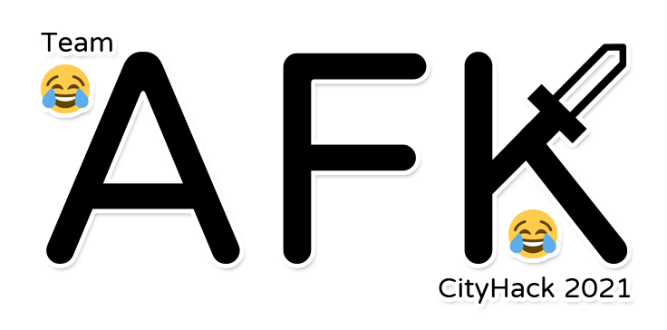

# CityHack2021 Team :joy:AFK:joy:
  
Demo movement patten can be seen on https://r48n34.github.io/motion/mo.html
## Better workout solution under Covid-19
  In such a environment that people trapped in the house, facing the monitor, typing words by words. Lack of exercise is a point that we concerns. 
 Moreover, lack of motivations to doing exercise make the siturations even more worst.  
 Hence, we introducting the mixed concept of social online game with motion capture devices - Motion capture devices and online game "AfterDay".
## Focus
 - Encourage people to do more exercise at home
 - Establish a social networking with exercise
 - Don't give up to exercise
  
## Motion capture devices
Details can be view on file (CityHack2021/motion capture devices)
## online game "AfterDay"
At the time of 2077, the planet was destroyed by humans pollutions.
In such a tough environment, a group of scientists invented the new generation power "Beta-kinetic" which is generated by exercising.
Meanwhile, due to the invention, creatures from several planet try to conquer this power to become stronger.
You, as a earth defender, will be the last hope to save humans cratures by exercise to combat others evil cratures.
Exercising, generate Beta-kinetic to become your power, defeat the evil through.

